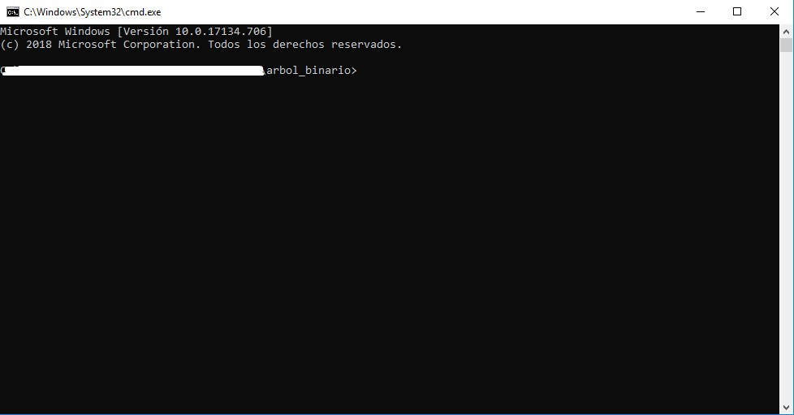
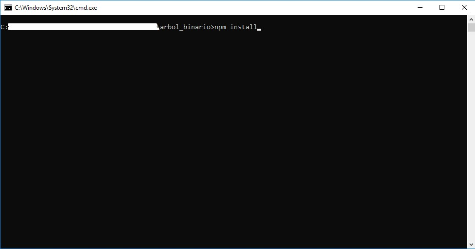
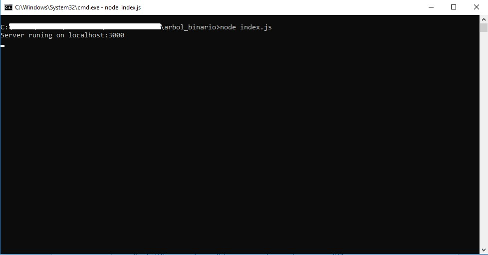
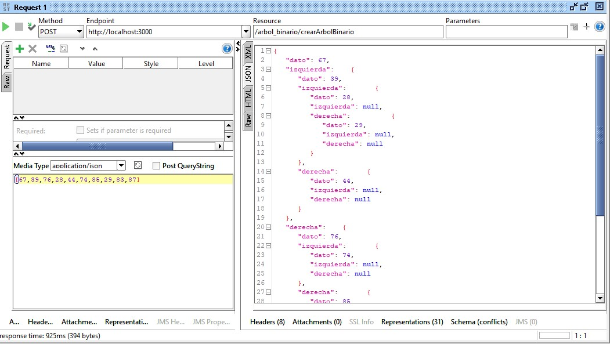
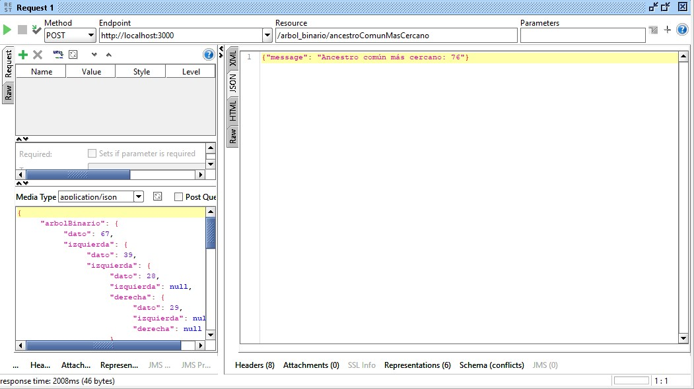

# Prueba técnica desarrollador back-end - Árbol binario

A continuación, el paso a paso para la ejecución de la prueba.

Precondiciones:
Antes de iniciar se debe contar con Node.js instalado, si no se encuentra instalado en la siguiente página se puede descargar: https://nodejs.org/es/download/

Una vez validadas las precondiciones los pasos a seguir son los siguientes:
- Clonar el proyecto: https://github.com/donbogo/arbol_binario.git
- Una vez clonado el proyecto abrir una terminal de comandos y ubicarse en la carpeta donde se encuentra el proyecto (arbol_binario).

- Ejecutar el siguiente comando que se utiliza para instalar todas las dependencias necesarias para poder ejecutar el proyecto: $ npm install

- Ejecutar el siguiente comando para iniciar el servicio REST: $ node index.js

- Una vez el servicio se encuentre disponible, por medio de un cliente se podrán consumir los siguientes dos servicios POST:
http://localhost:3000/arbol_binario/crearArbolBinario (Servicio para la creación del árbol binario)
http://localhost:3000/arbol_binario/ancestroComunMasCercano (Servicio para la consulta del ancestro común más cercano)
- Para el consumo del servicio de creación del árbol binario (http://localhost:3000/arbol_binario/crearArbolBinario) se debe enviar en el body un arreglo con los números que van a hacer parte del árbol binario, siendo el primer número del arreglo el número raíz, ejemplo: [67,39,76,28,44,74,85,29,83,87]

El resultado del servicio, la creación del árbol binario es el insumo para el servicio de consulta del ancestro común más cercano. 
- Para el consumo del servicio de consulta del ancestro común más cercano (http://localhost:3000/arbol_binario/ancestroComunMasCercano) se debe enviar en el body el árbol binario y los dos nodos, a continuación, ejemplo de como se debe enviar los datos:
 {
	"arbolBinario": {
		"dato": 67,
		"izquierda": {
			"dato": 39,
			"izquierda": {
				"dato": 28,
				"izquierda": null,
				"derecha": {
					"dato": 29,
					"izquierda": null,
					"derecha": null
				}
			},
			"derecha": {
				"dato": 44,
				"izquierda": null,
				"derecha": null
			}
		},
		"derecha": {
			"dato": 76,
			"izquierda": {
				"dato": 74,
				"izquierda": null,
				"derecha": null
			},
			"derecha": {
				"dato": 85,
				"izquierda": {
					"dato": 83,
					"izquierda": null,
					"derecha": null
				},
				"derecha": {
					"dato": 87,
					"izquierda": null,
					"derecha": null
				}
			}
		}
	},
	"nodo1": 74,
	"nodo2": 87
}

